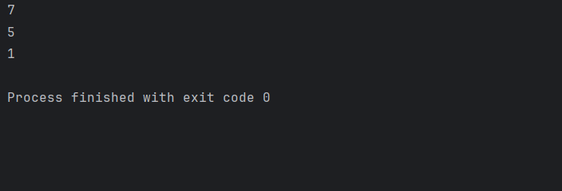

#### Q.1) Longest Increasing Subsequence using Dynamic Programming

#### Problem Explanation
A **longest increasing subsequence** (LIS) is a subsequence of an array where all elements are in increasing order, and the subsequence is as long as possible. A subsequence maintains the original order of elements, but not necessarily contiguity.

For example, given the array `[2, 3, 1]`, the longest increasing subsequence is `[2, 3]`.

